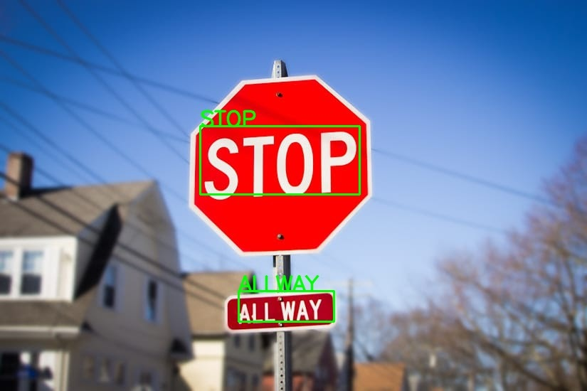

# IDS705_TeamOrange
# Optical Character Recognition
- This project aims to envision a solution to real-time street recognition problem, which can have impactful applications including but not limited to: assisting the visually impaired and auto-pilot vehicle systems. 

## OCR Pipeline Architecture

## I Text Localization
## II Character Segmentation
## III Character Recognition
**(1)** Logistic Regression \
**(2)** SVM \
**(3)** Multilayer Perceptron \
**(4)** AlexNet \
**(5)** LeNet 

## Datasets

**EMNIST** \
* Link to the dataset: https://www.nist.gov/itl/products-and-services/emnist-dataset \
The EMNIST (Extended MNIST) dataset is a set of handwritten character digits that follows the same conversion paradigm used to create the MNIST dataset. It is converted to a 28x28 pixel image format and dataset structure, and the result is a set of datasets that constitute a more challenging classification task involving letters and digits. In this dataset, there are six different splits provided. For the ease of comparison, we used the EMNIST Balanced split, which includes 47 balanced classes, with 131,600 alphanumeric characters in total. Moreover, this dataset shares the same image structure and parameters as the original MNIST task, which allows for direct compatibility with all existing classifiers and systems. \

**Chars74K** \
* Link to the dataset: http://www.ee.surrey.ac.uk/CVSSP/demos/chars74k/ \
The Chars74K dataset is the other dataset we used. This dataset consists of symbols used in both English and Kannada. We used the English part of the dataset, which consists of 64 classes (0-9, A-Z, a-z), with a total of 7705 characters obtained from natural images, 3410 hand drawn characters using a tablet PC, and 62992 synthesised characters from computer fonts. This gives a total of over 74K image samples. \

