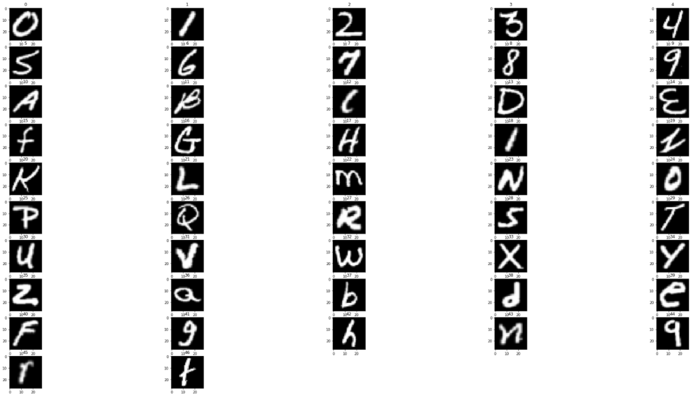
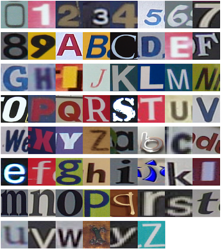

# IDS705_TeamOrange
# Optical Character Recognition
- This project aims to envision a solution to real-time street recognition problem, which can have impactful applications including but not limited to: assisting the visually impaired and auto-pilot vehicle systems. 

- We propose a pipeline that combines a tuned convolutional neural network (CNN) model (LeNet) and an existing deep learning model (OpenCV’s EAST text detector), which yields relatively accurate text detection and localization results for street sign images.

- This pipeline performs text localization, character segmentation, and character classification from input text-based images, and outputs recognized digital text as the results. When further combined with a text-to-speech program, this pipeline can potentially provide people who are blind or visually impared with the technology and ability to recognize and read street signs. 

## OCR Pipeline Architecture

 \
*Pipeline flowchart*

During the early stage of the analysis, we trained 3 traditional machine learning models and 2 CNN models on the EMNIST Balanced dataset and evaluated our model performance by comparing the accuracy scores across five different models. 

**(1)** Logistic Regression \
**(2)** SVM \
**(3)** Multilayer Perceptron \
**(4)** AlexNet \
**(5)** LeNet 

Below summarizes accuracies from those models: \
 \
*Summary Table of Test Accuracy by Model*

## Datasets

**EMNIST** \
(*Link to the dataset: https://www.nist.gov/itl/products-and-services/emnist-dataset*) \
The EMNIST (Extended MNIST) dataset is a set of handwritten character digits that follows the same conversion paradigm used to create the MNIST dataset. It is converted to a 28x28 pixel image format and dataset structure, and the result is a set of datasets that constitute a more challenging classification task involving letters and digits. In this dataset, there are six different splits provided. For the ease of comparison, we used the EMNIST Balanced split, which includes 47 balanced classes, with 131,600 alphanumeric characters in total. Moreover, this dataset shares the same image structure and parameters as the original MNIST task, which allows for direct compatibility with all existing classifiers and systems. 

 \
*EMNIST Balanced Dataset Structure*

 \
*EMNIST Balanced Dataset Visualization - 47 Classes*

**Chars74K** \
(*Link to the dataset: http://www.ee.surrey.ac.uk/CVSSP/demos/chars74k/*) \
The Chars74K dataset is the other dataset we used. This dataset consists of symbols used in both English and Kannada. We used the English part of the dataset, which consists of 64 classes (0-9, A-Z, a-z), with a total of 7705 characters obtained from natural images, 3410 hand drawn characters using a tablet PC, and 62992 synthesised characters from computer fonts. This gives a total of over 74K image samples. 

 \
*Chars74K Dataset Visualization - 64 Classes*

## Conclusions
Currently, our pipeline is only suitable for detecting text in static images. Going forward, we would also like to apply this technique to perform real-time text recognition. Once we have optimized the performance of our model to a greater extent, we can integrate our OCR pipeline with services that convert text into audible speech (e.g., AWS Text-to-Voice Solutions) for close-to real-time street navigation aid. Although there still exists a gap in terms of accuracy and computational speed between our pipeline and cutting-edge OCR techniques, we believe this project has made a meaningful attempt in envisioning a more tech-integrated environment where people with disabilities can lead a quality life just like other members of the society. 
